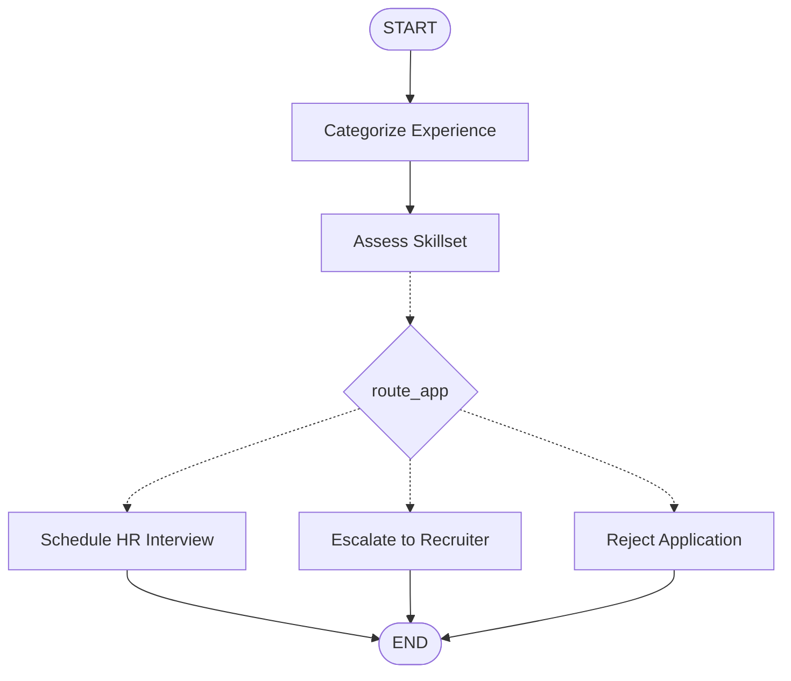

This project is an automated recruitment screening pipeline built with **LangGraph** and **LangChain**. It uses a stateful workflow to evaluate candidate job applications based on experience levels and skillset alignment using the **Groq API** (via `ChatGroq`).

## 🚀 Features
- **Experience Categorization**: Classifies candidates into 'Entry-level', 'Mid-level', or 'Senior-level'.
- **Skill Alignment Assessment**: Evaluates if the candidate's skills match the target job requirements (e.g., Python Developer).
- **Conditional Routing**: Automatically routes applications to different outcomes:
  - **Match** $\rightarrow$ Shortlisted for an HR interview.
  - **Senior-level + No Match** $\rightarrow$ Escalated to a human recruiter.
  - **Other + No Match** $\rightarrow$ Automated rejection email.
- **State Management**: Orchestrated cleanly using LangGraph's state graphs.

---

## 🛠️ Tech Stack
- **Frameworks**: LangChain, LangGraph
- **LLM Provider**: Groq API (`ChatGroq`)
- **Development Environment**: Google Colab / Jupyter Notebook
- **Language**: Python

---

## 📦 Installation

To run this project locally or in your notebook, install the necessary dependencies:

```bash
pip install langchain langchain_core langchain_community langgraph langchain_openai langchain-groq
```

---

## 🔑 Setup

Before running the screening workflow, you must set up your Groq API key:

### Google Colab Setup
1. Go to the **Secrets** (Key icon) tab in Google Colab.
2. Add a new secret named `groqApiKey`.
3. Paste your Groq API key as the value and toggle **Notebook Access** to ON.

### Local Environment Setup
```bash
export GROQ_API_KEY="your_groq_api_key_here"
```

---

## 🗺️ Workflow Diagram

Below is the structured execution graph of the application routing:



---

## 📝 Usage Example

```python
application_text = "I have 5 years of experience in software engineering with expertise in Python"
results = run_candidate_screening(application_text)

print(f"Experience Level: {results['experience_level']}")
print(f"Skill Match: {results['skill_match']}")
print(f"Response: {results['response']}")
```
"""
